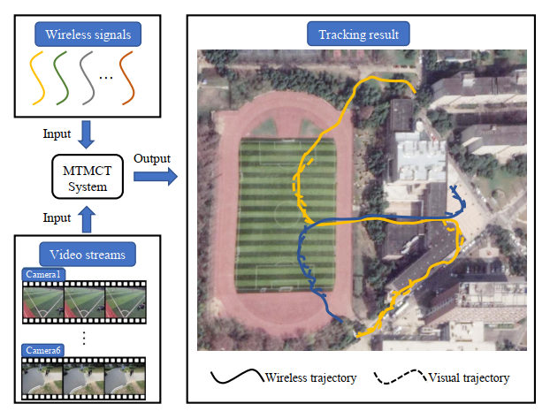

# WP-MTMCT
Implementation of "Wireless-Aware Progressive Framework for Multi-Target Multi-Camera Tracking"

## News
**2021.4.19** The code of updated version of RCPM and post process has been uploaded.

## Overview
An overview of the problem studied in this work:

## Abstruct
We define a new task of Multi-Target Multi-Camera Tracking (MTMCT) with both visual and wireless data. This task takes as input a set of synchronized video streams from different cameras and a set of wireless positioning trajectories of pedestrians carrying mobile devices. Our purpose is to infer a complete visual trajectory for each pedestrian. Note that the visual data is unlabeled, without the correspondence between wireless signal and pedestrians. Through the introduction of wireless signal, the performance of the MTMCT tracker is expected to improve. At the same time, the cost of data annotation is significantly reduced, which promotes the application of this paradigm to real world scenarios.

## Video demos on WP-MTMCT dataset

If you are interested in WP-MTMCT dataset, please contact us by email ssjxjx@mail.ustc.edu.cn

The complete code will be release soon.
